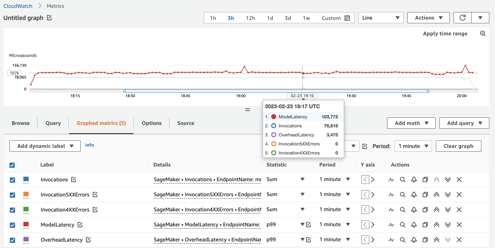
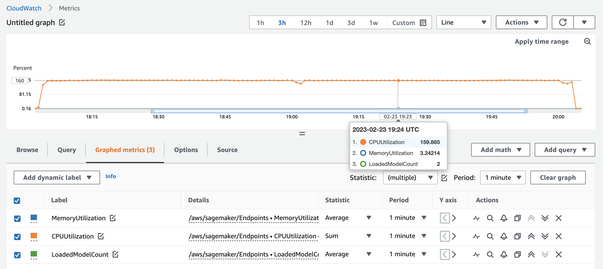

# weighted-mme-load-test
Weighted load traffic distribution across models behind an XGBoost MME Endpoint

## Metrics

We achieve about ~1100 TPS on a singular ml.m5.xlarge. We have configured the traffic to hit one model 3x more than the other. Hardware saturation is at about 160% out of 4 available cores which is 400% availability. To further increase load, increase workers and users in the distributed.sh (users are a multiple of workers).

